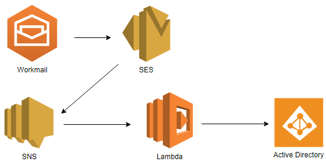

# Adding User to specific Groups by sending Mails

Putting user into AD Groups manually can be a pain. How convinient it would be to do the same by just sending a simple Email?

With this script you can define a set of email addresses which have the permission to put users into their groups. Additionally, you define a list of groups the user can be added to.

For the automation part, you create a new Email for example using *Workmail* from AWS. Then you create a *SES* Rule to trigger, everytime this mailbox receives an Email. This SES rule triggers a *SNS Topic* which will excecute the Lambda function.

**Things you have to change**

- Change the User you use to connect to the AD
- Change the email addresses and the AD Groups you want to use.
- Make sure the Lambda is running within a private subnet, connected to a NAT Gateway. **(Very important, because it took quite a while to find this error)**
- Make sure Lambda has SES Access.
- You have to upload the packages for the LDAP3 module, since Lambda can't import it otherwise. 

To do this, you create the lambda file somewhere on your machine. Then you type:

    pip install ldap3 -t ./
    chmod -R 755 .
    zip -r ../add_user.zip .
    
This will download the ldap3 module into your current folder, changes the permissions for the files and then zips everthing into the parent folder.
Now you can upload everything to your function.
    
